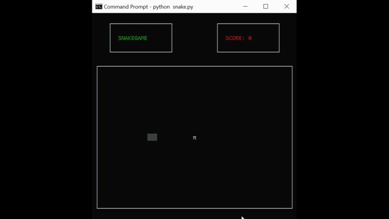

# snakegame

A basic retro game inspired by [engineer-man](https://github.com/engineer-man) series in youtube. Go check the original code [here](https://github.com/engineer-man/youtube/tree/master/015).

## Lest's start 

#### Install puthon 3

Download and install package from [python.org](https://www.python.org/downloads/).


#### Install curses library
 Open the command line and type the command bellow.
 
 ```
 pip install windows-curses
 ````

#### Run the snake.py file
Go to the location folder and run the snake.py file.
 ```
 python snake
 ````
#### Let's play
This should appear in your command line.




